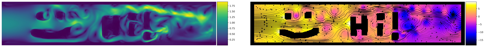
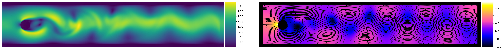
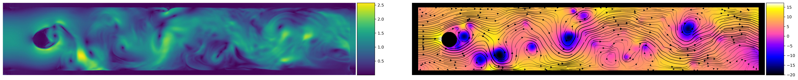
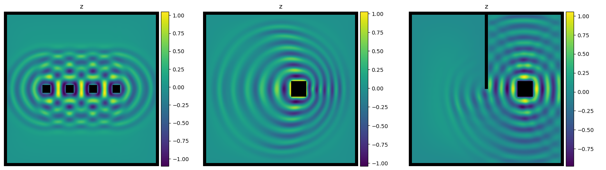

# Spline-PINN
Approaching PDEs without Data using Fast, Physics-Informed Hermite-Spline CNNs






Hi!

In this repository, we provide you with code and pretrained models to reproduce the results of our paper on Spline-PINNs.
Furthermore, we provide code so you can train your own PDE models for the incompressible Navier-Stokes and wave equation without any ground truth data.


## Publications

Comprehensive background information is provided in our paper:  
[Spline-PINN: Approaching PDEs without Data using Fast, Physics-Informed Hermite-Spline CNNs](https://arxiv.org/abs/2109.07143)  
*Nils Wandel, Michael Weinmann, Michael Neidlin, Reinhard Klein*, AAAI, 2022 ([Supplemental video](https://www.youtube.com/watch?v=QC98LCtCZn0), [1 min introduction video](https://www.youtube.com/watch?v=C5IAfCfcyDQ), [20 min presentation](https://www.youtube.com/watch?v=H0g6Tm1zio8))

This physics-*informed* method builds up on previous work that relies on a physics-*constrained* loss based on a finite difference marker and cell grid. Respective publications for 2D and 3D fluid simulations can be found here:

2D: 
[Learning Incompressible Fluid Dynamics from Scratch - Towards Fast, Differentiable Fluid Models that Generalize](https://arxiv.org/abs/2006.08762)  
*Nils Wandel, Michael Weinmann, Reinhard Klein*, ICLR, 2021 ([Code](https://github.com/aschethor/Unsupervised_Deep_Learning_of_Incompressible_Fluid_Dynamics),[Video](https://www.youtube.com/watch?v=EU3YuUNVsXQ),[Spotlight presentation](https://www.youtube.com/watch?v=wIvFkhsIaRA))

3D: 
[Teaching the Incompressible Navier Stokes Equations to Fast Neural Surrogate Models in 3D](https://arxiv.org/abs/2012.11893)  
*Nils Wandel, Michael Weinmann, Reinhard Klein*, Physics of Fluids, 2021 ([Code](https://github.com/aschethor/Teaching_Incompressible_Fluid_Dynamics_to_3D_CNNs),[Video](https://www.youtube.com/watch?v=tKcYJaJtHJE))

## Installation

First, create a new Conda-environment:

```
conda create --name my_cool_fluid_env python=3.7  
conda activate my_cool_fluid_env
```

Now, install the following packages:

```
conda install pytorch torchvision cudatoolkit=10.2 -c pytorch  
conda install matplotlib statsmodels natsort tensorboard pyevtk  
pip install opencv-python
```

Finally, clone this github repository. If you want to use pretrained models, download the following zip-file and extract its content into a folder named "/Logger": [https://cg.cs.uni-bonn.de/backend/v1/files/code/Spline_PINN/Logger.zip](https://cg.cs.uni-bonn.de/backend/v1/files/code/Spline_PINN/Logger.zip)

... and you're done :)  
The installation was tested on Ubuntu 18.04, but other operating systems should work as well. 
If you have troubles with cuda (e.g. because you don't have a GPU at hand), use the "\-\-cuda=f" option for all of the following python scripts.

## Interactive Demo and Visualization

We provide you with several pretrained models so you can directly start to play around with our interactive demos.

### Fluid demo

The first model was trained with mu=0.1 and rho=10. To start the interactive fluid simulation, run:

```
python fluid_test.py --net=Fluid_model --hidden_size=50 --mu=0.1 --rho=10
```

By pressing the following keys, you can:

- "n": start a new (random) simulation  
- "p": create a visualization of the current fluid state with matplotlib  
- "q": quit the simulation  

There are several options to interact with the simulation:

- By pressing the left mouse button, obstacles can be moved within the fluid domain.
- The following keyboard commands can be used to:  
"x": increase the flow speed  
"y": decrease the flow speed  
"w": write new domain boundaries where the mouse is located  
"e": erase domain boundaries where the mouse is located  
"s": increase the angular velocity (only for spinning cylinder)  
"a": decrease the angular velocity (only for spinning cylinder)  

If you want to create your own custom obstacles, please have a look into fluid_test.py and fluid_setup.py.

In case you want to try out further viscosities and densities, we provide you with the following additional pretrained models:

- (mu=1, rho=1)
- (mu=0.1, rho=1)
- (mu=0.01, rho=10)

If you want to train your own models with arbitrary viscosities and densities, please have a look below at the training section.

### Wave demo

We also provide you with a pretrained model for the wave equation. To start the wave simulation, call:

```
python wave_test.py --net=Wave_model --stiffness=10 --damping=0.1
```

As for the fluid simulation, by pressing the following keys, you can:

- "n": start a new (random) simulation  
- "p": create a Visualization of the current fluid state with matplotlib  
- "q": quit the simulation  

## Train your own PDE models

The following lines of code show how you can train your own PDE models without having to worry about ground truth data.

### Fluid model

Let's assume, you want to train a new fluid model with viscosity mu=0.5 and density rho=4. The loss weight for the residuals of the Navier-Stokes equation (loss_domain_res or alpha in equation 9 of the paper respectively) is set to 10 and the loss for the domain boundaries (loss_bound or beta in equation 9 of the paper respectively) is set to 20. Then, simply call:

```
python fluid_train.py --net=Fluid_model --hidden_size=50 --mu=0.5 --rho=4 --loss_domain_res=10 --loss_bound=20
```

If you want to get more information about all the training parameters, call:

```
python fluid_train.py --help
```

If you want to oversee the training progress with tensorboard, run:

```
tensorboard --logdir=Logger/tensorboard
```

If you want to have a look at the outcome of your freshly trained model, call:

```
python fluid_test.py --net=Fluid_model --hidden_size=50 --mu=0.5 --rho=4
```

### Wave model

Training of wave models works analogous to the training of fluid models. Let's assume, you want to train a model with stiffness=5 and damping=0.1, then call:

```
python wave_train.py --net=Wave_model --hidden_size=50 --stiffness=5 --damping=0.1 --loss_v=1 --loss_wave=0.1 --loss_bound=10
```

Here, loss_v, loss_wave and loss_bound correspond to alpha, beta and gamma in equation 13 of the paper respectively. 
As for the fluid model, you can get more information about training parameters and launch tensorboard using the following commands:

```
python wave_train.py --help  
tensorboard --logdir=Logger/tensorboard
```


## License

Feel free to clone this repository and modify it! If it's of good use for you, please consider giving this repository a star and citing our publications.  
If there are questions left, just contact us: wandeln@cs.uni-bonn.de

## References

The U-Net implementation is for the most part taken from https://github.com/milesial/Pytorch-UNet/ - an Open Source implementation of:  

[U-Net: Convolutional Networks for Biomedical Image Segmentation](https://arxiv.org/abs/1505.04597)  
*Olaf Ronneberger, Philipp Fischer, Thomas Brox*, MICCAI, 2015
